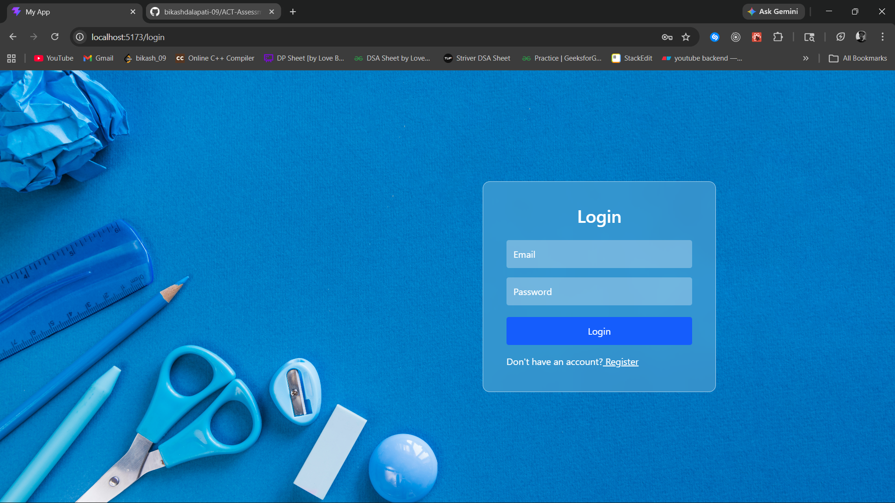
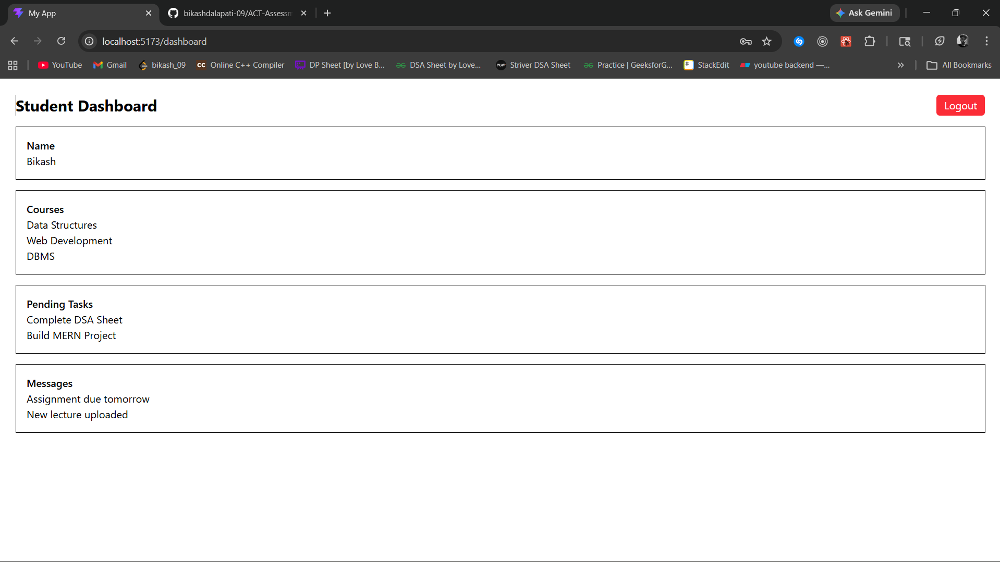

# Simple Authentication App (React + Node.js)

## Features

* User Register
* User Login
* User Logout
* Navigation using **Link** and **useNavigate**

---

## Frontend (React)

### Used:

* React Router DOM
* Link (for navigation)
* useNavigate (for redirect after login/logout)
* Axios (for API calls)

### Pages:

* Register Page
* Login Page
* Dashboard Page

### Navigation Example:

* Register → Login (using Link)
* Login → Register (using Link)
* Login → Dashboard (using useNavigate)
* Logout → Login (using useNavigate)

---

## Backend (Node.js / Express)

### API Routes:

* `POST /api/auth/register` → Register user
* `POST /api/auth/login` → Login user
* `POST /api/auth/logout` → Logout user

### Authentication:

* JWT Token stored in **Browser as cookie**

---

## Tech Stack

* React
* Node.js
* Express
* MongoDB
* JWT
* Cookie-Parser
* cors

---
## Screenshots

### Login Page

### Dashboard

---

## Author

**Bikash Dalapati**
